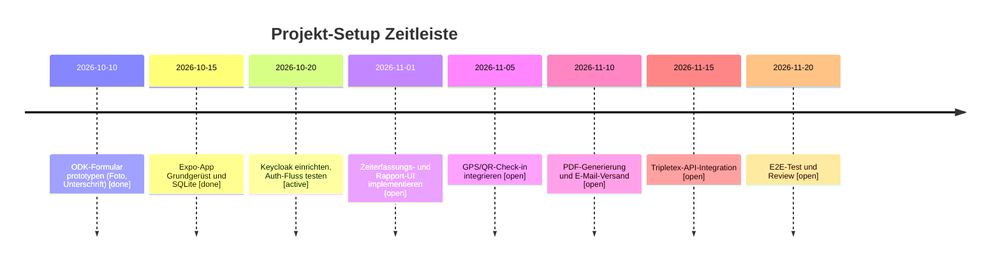

# DEEP RESEARCH – ORIGINALANHANG (nicht validiert)

> **Quellenstatus: Rechercheentwurf vom 08.10.2026.** Dies ist die unveränderte, vom Nutzer hochgeladene Recherche mit zusätzlicher Statuswarnung; keine angenommene ISA-Spezifikation. Die genannten Prozentangaben sind grobe Schätzungen, und die im Beispielzeitplan als `[done]` markierten ZUKÜNFTIGEN Tätigkeiten sind **nicht nachweislich erledigt**. Rechtliche und technische Aussagen müssen vor Produktiveinsatz geprüft werden.
>
> Für das Meeting ist die kundenbezogene Ansicht `#/workshop` maßgeblich. Kundenaussagen und eigene Vorschläge strikt trennen.

---

# Executive Summary  
Jobbkontroll ist eine norwegische, kommerzielle Bauzeiten-App, die **Zeiterfassung, Projektmanagement, HSE/KS und Fakturagrundlagen** in einem System vereint. Mitarbeiter „stempeln“ sich mobil am Einsatzort ein/aus, können Projekte wechseln und Fotos melden. Auf Büroseite werden Budgets in Echtzeit gemessen und Stunden direkt ins Rechnungsgrundlage übernommen. Allerdings fehlen spezialisierte Rapporte für Kernbohren/Sägen und eine eingebaute Tripletex-Schnittstelle.  
Rechtlich gilt: **Software-Funktionen (Idee/Prozess)** sind nicht durch das Urheberrecht geschützt – nur Code und Ausdrucksform. Das heißt: Wir dürfen Abläufe *nachbauen*, müssen aber eigenen Code schreiben und Drittnamen/Logos meiden. Eine “Clean-Room”-Entwicklung ist ratsam: Wir entwerfen neue UI/UX und rufen nur offene Schnittstellen (z.B. Tripletex-API) auf. Lizenzrechtlich ist Jobbkontroll selbst geschlossen (kein OSS), wir können aber seine Ideen frei implementieren (UrhG §69a Abs.2). 

In Phase 2 vergleichen wir offene OSS-Projekte für die Kernfunktionen: Zeiterfassung, Baustellen-Check-in (QR/GPS), Offline-Arbeit, Rapportformulare mit Foto/Unterschrift, Preislogik, PDF-Export und Tripletex-Integration. Daraus entsteht eine **Shortlist** aus sieben Lösungen mit Lizenz, Abdeckung und Integrationsrisiko. Basierend darauf schlagen wir eine schlanke Architektur vor: z.B. eine **Expo/React-Native-App** (MIT) mit lokaler SQLite (public domain) und Geo-Location, Authentifizierung via Keycloak (Apache 2.0) oder AWS Cognito, Backend (Node.js+PostgreSQL), PDF/Signatur-Bibliotheken (z.B. pdfme, signature_pad) und Anbindung an Tripletex-API.   

**Empfehlung:** Kurzfristig gezielt bestehende OSS-Bausteine testen (z.B. *ODK Collect* für Offline-Formulare, *Solidtime* für Zeiterfassung) statt gleich ein großes ERP einzuführen. **Langfristig** bauen wir eine eigene ISA-App mit bewährten OSS-Komponenten, ohne fremde Quelltexte zu kopieren, und nutzen Tripletex wie vorgesehen als Buchhaltungssystem. Bei Lizenzunsicherheiten (z.B. AGPL-Komponenten) raten wir zur Anwaltfrage.  

## 1. Rechtliche Prüfung: Funktionen nachbauen?  
Nach deutschem Urheberrecht (§69a UrhG) sind **Ideen, Verfahren oder Prinzipien einer Software nicht geschützt**. Das heißt: ProRiv darf die **Arbeitsabläufe** von Jobbkontroll übernehmen, muss aber **eigenen Code/UI** schreiben. Konkrete Arbeitsschritte (Stempeln, Projektwechsel, Foto erfassen) dürfen wir nachbauen – der Code und spezifische Texte von Jobbkontroll nicht. GUI-Elemente können markenrechtlich geschützt sein; deshalb verwenden wir eigene Icons und Layouts. Besonders wichtig ist: *keine* Kopie des Jobbkontroll-Codes oder geschützter Assets, *keine* Nutzung des Namens als Bezeichnung für unsere Lösung. Für APIs gilt: Tripletex bietet eigene Schnittstellen, die wir legal nutzen können – wir laden sie gemäß deren Nutzungsbedingungen (OAuth-Token etc.).  

> **Zitat:** Laut UrhG „sind Ideen und Prinzipien, die einem Programm zugrunde liegen, *nicht geschützt*“. Wir können also die **Funktion** der Zeiterfassung oder des QR-Checkins neu erstellen, solange wir den Code selbst entwickeln.  

## 2. Jobbkontroll vs. ProRiv-Anforderungen (Infografik)  
Die Grafik vergleicht Anforderungen aus dem Kunden­gespräch mit den Jobbkontroll-Funktionen. Auf der linken Seite steht jeweils eine Anforderung (z.B. „Arbeitsbeginn/Ende/Pauser“ mit Uhr-Icon, „Check-in QR/GPS“ mit Standort-Icon, „Rapport mit Foto/Signatur“ etc.). Rechts davon zeigt ein Häkchen oder Kreuz, ob Jobbkontroll diese Funktion bietet. Jobbkontroll deckt **Zeiterfassung**, Projektverwaltung, Offline-Erfassung, Baustellen-Check-in, PDF-Stundenzettel und Kundenunterschrift ab (dargestellt durch grüne Haken). **Fehlend** sind laut Hersteller **spezielle Rapport-Formulare** (z.B. für Kernbohren/Sägen), **automatische Preisberechnung** nach Durchmesser/Steigung sowie ein **Rapport-Versand mit Bestätigen/Ablehnen**. Auch eine fertige Tripletex-Integration gibt es nicht. Diese Lücken werden mit roten Kreuzen oder Fragezeichen markiert. Insgesamt hält die Grafik die Kernaussage: Jobbkontroll erfüllt viele Basisfunktionen (Zeit, Projekte, GPS/QR), aber die ProRiv-spezifischen Anforderungen (Bohrpreise, Rapportsystem) fehlen.  

*Infografik-Vorlage:*  
- **Layout:** Zwei Spalten (Anforderung | Jobbkontroll).  
- **Links:** Icons + kurze Stichworte für jede Anforderung (z.B. Uhr, Baustelle, PDF, Lupe).  
- **Rechts:** Häkchen-Symbole (✅) für vorhandene Features, ✖️ für nicht nachgewiesene.  
- **Farbgebung:** Grün für „erfüllt“, Rot für „fehlend“. Klare Legende.  
- **Tipp:** Wenig Text, große Symbole. Der Fokus liegt auf dem Vergleich, nicht auf Details.  

## 3. Top-7 Open-Source-Shortlist  
Wir haben relevante OSS-Projekte ausgewählt und priorisiert nach **Lizenz**, **Funktionsabdeckung** und **Integrationsrisiko**. (Die Prozentzahlen sind grobe Einschätzungen, in Klammer Beispiele für abgedeckte Anforderungen.)  

| Projekt (Quelle)              | Lizenz       | Abdeckung (%)        | Risiko (Hoch/Mittel/Niedrig)    | Nächster Schritt                |
|-------------------------------|--------------|----------------------|-------------------------------|---------------------------------|
| **ODK Collect** (getodk.org) | Apache 2.0  | 60 % (Offline-Formulare mit Foto/GPS) | Mittel (Einarbeitung)   | Prototyp: Rapport-Formular bauen (Felder, Foto, Unterschrift) |
| **ERPNext (Frappe)** (frappe.io) | GPL 3.0     | 80 % (ERP-Funktionen, Preislisten, Rabatte) | Hoch (Komplex, Datenmodelle) | Evaluierung: Preislisten-Setup prüfen |
| **Expo (React Native)** (expo.dev) | MIT         | 20 % (App-Framework, UI-Gerüst)               | Niedrig               | Basis-App mit Timer/DB erstellen |
| **Keycloak** (keycloak.org)  | Apache 2.0  | 10 % (Auth/SSO)                              | Niedrig               | Auth-Prototyp (Benutzer/Rollen)  |
| **Traccar** (traccar.org)      | Apache 2.0  | 20 % (GPS-Tracking, Geofence)               | Mittel                | Einfaches GPS-Tracking prüfen     |
| **Solidtime** (solidtime.io) | AGPL 3.0    | 40 % (Zeiterfassung, Projekte, Clients) | Hoch (AGPL)          | Demo: Arbeitszeiten erfassen      |
| **DocuSeal** (docuseal.co)    | AGPL+      | 30 % (PDF-Generierung, Online-Signatur)      | Hoch (Lizenz)        | Test: PDF mit Unterschrift exportieren |

**Anmerkungen:**  
- *Abdeckung*: Prozentschätzung, wie viel der ProRiv-Funktionalität grob implementierbar ist. (z.B. deckt ODK Formular-Logik inkl. Offline und Medien ab.)  
- *Integrationsrisiko*: z.B. „AGPL“ bedeutet, Änderungen bei Servereinsatz offenlegen zu müssen.  
- *Lizenzkompatibilität*: Apache/MIT sind unkritisch; GPL/AGPL erfordern Offenlegung bei Deployment. Eventuell ist eine kommerzielle Nutzung (mit Lizenzweitergabe) nötig.  

Zu jedem Projekt: Wir empfehlen sofort einen kurzen Test oder Prototyp. Beispielsweise mit **ODK Collect** schnell ein Eingabeformular (z.B. Bohrdurchmesser, Tiefe) bauen, um zu sehen, ob es offline und mobil praktikabel ist. **ERPNext** bietet viele Geschäftsregeln (Preislisten, Rabatte), ist aber ein komplettes ERP und damit sehr aufwendig. **Expo** und **Keycloak** dienen als Bausteine für unsere eigene App: Expo erstellt die Mobile-App (MIT) und Keycloak managt Authentifizierung. **Solidtime** und **DocuSeal** demonstrieren bereits implementierte Lösungen für Zeiterfassung und E-Signatur, die wir inspizieren können.  

## 4. Architekturvorschlag und Komponenten  
Basierend auf obiger Analyse schlagen wir folgende Minimal-Architektur vor:

- **Mobile App:** Native Apps mit **Expo (React Native, MIT)** für iOS/Android. Vorteile: einfacher Einstieg, Cross-Platform, Zugriff auf Kamera und GPS. Offline-Datenhaltung lokal via **SQLite** (public domain) oder **PouchDB** (Apache 2.0). Beispielsweise speichert die App Zeiteinträge und Fotos lokal, bis wieder Online ist.  

- **Authentifizierung:** **Keycloak** (OpenID/OAuth2, Apache 2.0) als Self-Host-Option (kostet Zeit zu betreiben), alternativ **AWS Cognito** (Cloud-Service). Keycloak bietet Rollen und Mandantenfähigkeit in OSS-Qualität. Durch SSO können sich Arbeiter mit derselben Firma/Projekt verbinden.  

- **GPS/Geofence:** Für Baustellencheck-in kann man einfach **Expo Location API** nutzen, um Koordinaten zu prüfen, oder einen Service wie **Traccar** (Apache 2.0) einsetzen. Traccar ist ein GPS-Tracking-Server, jedoch komplex. Extern kann man z.B. Workaround-Codes per NFC/QR nutzen. Beispiel: Ein QR-Code an der Baustelle wird gescannt (Expo-Kamera-Modul), App validiert Standort.  

- **Offline-Sync:** Zur Synchronisation empfehlen sich Bibliotheken wie **PouchDB/CouchDB** (Apache 2.0) oder **SQLite + custom Sync**. ODK verwendet ähnliches Prinzip: Formulare offline erfassen und später uploaden. Wir müssten eine Konfliktlogik implementieren (wer hat was zuletzt geändert).  

- **Backend & Datenbank:** **Node.js/Express** oder Python/Flask mit einer **PostgreSQL**-Datenbank (beides Open Source). Hier laufen Webhooks, API-Logik, PDF-Erzeugung und Tripletex-Anbindung. PostgreSQL (Open Source) speichert alle Daten sicher. Als Hosting: Selbst-Hosting auf AWS/Hetzner oder Managed (Heroku/Vercel).  

- **Rapport/PDF:** Für Kundennachweise generiert das Backend PDF-Reports. Bibliotheken wie **pdfme** (MIT) oder **pdfkit** können Vorlagen ausfüllen. Die App sammelt Rapportdaten (Material, Maße, Bilder, Unterschrift). Die Unterschrift erfasst das Frontend mit **signature_pad** (MIT) und überträgt das Bild. Alternativ könnte man **DocuSeal** (AGPL) einsetzen, wenn rechtlich akzeptabel, da es kompletten Signatur-Workflow bereitstellt.  

- **Tripletex-Integration:** Tripletex hat eine umfassende REST-API (siehe Entwicklerportal). Wir richten im Backend einen Connector ein, der Stunden- und Leistungseinträge als Beleg oder zeitliche Buchung an Tripletex sendet. Das Risiko ist moderat: API-Dokumentation existiert, aber es gibt keine fertige OSS-Lösung dafür. Wir müssen uns um Authentifizierung (OAuth) und Datenmapping kümmern.  

- **Hosting & Betrieb:** Für Nachrichten (E-Mail/SMS) können Services wie AWS SES oder Twilio eingesetzt werden (nicht OSS, aber etabliert). Die laufenden Kosten (Server, SMS-Guthaben) sind zu kalkulieren. Lizenzen: Apache/MIT-Projekte brauchen keine Gebühren. GPL/AGPL zwingt zur Veröffentlichung serverseitiger Änderungen – wir müssten prüfen, ob das Probleme macht (rechtliche Beratung empfohlen).  

## 5. Schritt-für-Schritt-Setup (Zeitplan)  
Für einen schnellen Start empfehlen sich folgende Schritte (8–12):

1. **Testumgebung einrichten:** Lokale Entwicklungsumgebung mit Node.js, Expo CLI und ggf. Docker (für Datenbank und Keycloak).  
2. **ODK-Formular prototypen:** Erstelle ein Musterformular (z.B. Kernbohr-Rapport mit Feldern „Durchmesser, Tiefe, Anzahl“, Foto, Unterschrift) in ODK Collect. Exportiere Testdaten, um Praxistauglichkeit zu prüfen.  
3. **Expo-App-Grundgerüst:** Mit `expo init` ein Projekt anlegen. Implementiere Navigation und Formscreens. Nutze **Expo Camera** für Fotos und **Location**-API für Geodaten.  
4. **SQLite/PouchDB einbinden:** Richte lokale DB ein (z.B. über `expo-sqlite` oder `pouchdb-react-native`). Teste das Speichern von Zeitstempeln und Formular-Daten offline.  
5. **Auth via Keycloak:** Starte einen Keycloak-Container. Konfiguriere Realm und Nutzer/Rollen („Mitarbeiter“, „Vorarbeiter“). Integriere Expo mit Keycloak (OAuth2/OpenID) für Login.  
6. **Zeiterfassungs-Flow:** Baue UI zum **Stempeln** (Start/Stop) mit Kommentarfeld. Eine Zeiterfassung-Entität erzeugen und in die lokale DB schreiben. Simuliere Offline-Grenzen.  
7. **GPS/QR-Check-in:** Implementiere Baustellen-Check: Scanner (QR) per Kamera, Auswertung (z.B. „UV-genehmigte“ Baustellencodes). Oder prüfe, ob App geofenced starten kann (Expo hat rudimentäre Background-Location).  
8. **Rapport-Funktionen:** Sammle Rapport-Details in der App (Materialpositionen, Einheiten, Fotos). Erzeuge ein JSON. Lasse das Backend (Node) daraus ein PDF erstellen (z.B. mit pdfme). Biete in der App eine „Sende an Kunde“-Funktion per E-Mail.  
9. **Tripletex-API testen:** Richte Tripletex-Testzugang ein (Developer Portal). Im Backend Autorisierungsflow implementieren (Client-Credentials oder OAuth). Versuche, einen Dummy-Stundeneintrag zu posten.  
10. **E-Mail/SMS:** Konfiguriere SMTP (z.B. Gmail/SendGrid) oder AWS SES, und Twilio-SMS für Benachrichtigungen. Teste das Versenden von Rapport-PDFs an eine Mailadresse oder Telefonnummer.  
11. **Backend-Logik & Sync:** Vollende die Server-API (CRUD) und automatisiere die Synchronisation: Wenn App online geht, lädt sie Einträge hoch und holt Updates. Achte auf Konfliktlösung (beispielsweise zuletzt geändert gewinnt).  
12. **Integrationstest & Deployment:** Führe End-to-End-Tests durch: Erzeuge einen realistischen Rapport, lasse ihn vom App-User senden, vom „Kunden“ bestätigen, und überprüfe korrekte Buchung in Tripletex. Dann bereite das System für die erste realen Nutzung vor.  

## 6. Empfehlung  
**Sofort testen:** Vor dem großen Bau einer eigenen Software sollten wir **erstmal ODK Collect und Co. ausprobieren**. Ein schneller ODK-Prototyp zeigt, ob wir komplexe Rapport-Formulare (mit abhängigen Feldern, Fotos, Unterschrift) ohne eigenes Coding realisieren können. Parallel ein kleines Expo-Projekt starten, um Basis-Workflows (Stempeln, Projektauswahl, Offline-Funktion) zu verifizieren. 

**Langfristig:** Ziel ist eine **schlanke ISA-App**, die gezielt die ProRiv-spezifischen Anforderungen erfüllt. Wir bauen auf **bewährten Open-Source-Bausteinen** (Expo, Keycloak, Node, etc.) auf und entwickeln nur das notwendige Business-Logic (z.B. Preisrechner für Bohrungen). Fremdsoftware wie Jobbkontroll oder CoreDocket dienen nur als Inspirationsquelle – wir kopieren sie nicht. Stattdessen nutzen wir Tripletex als ERP/Buchhaltung weiter (laut Kundenwunsch) und kommunizieren über deren öffentliche API. Bei Unsicherheit bezüglich Lizenzen (vor allem GPL/AGPL) sollten wir rechtlichen Rat einholen, um die Veröffentlichungspflichten zu klären.

**Quellen:** Offizielle Produktseiten und Repos (Jobbkontroll, ODK, ERPNext, Keycloak, Solidtime, Tripletex-Devdocs). Diese Recherche fasst unseren aktuellen Kenntnisstand zusammen und hilft, schnelle Experimente zu priorisieren.  
